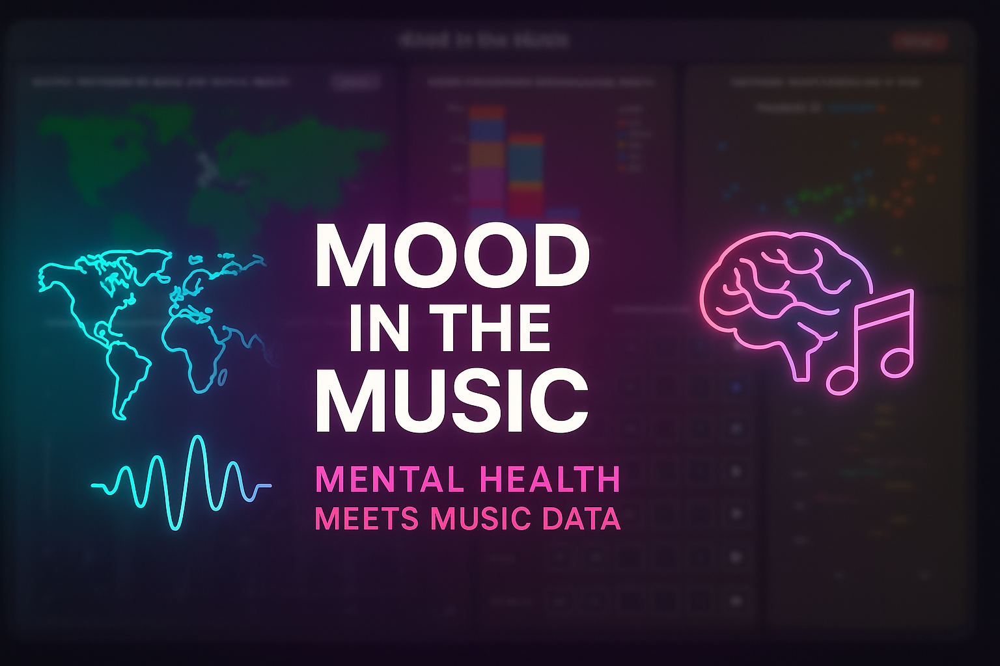

<p align="center">
  
</p>

# Visualization Dashboard for Mental Health and Music Features Analysis

Welcome to the **Visualization Dashboard for Mental Health and Music Features Analysis**!  
This project is an innovative tool designed to bridge the gap between mental health metrics and music features, offering users a comprehensive platform to explore, analyze, and visualize data interactively. By leveraging advanced data processing techniques and machine learning models, this dashboard empowers users to uncover meaningful insights and patterns.

### Project Demo  
Watch the project in action: [Mood in the Music - Visualization Dashboard Demo](https://youtu.be/_6ImutQZxgU)

---

## Overview

The dashboard provides an intuitive interface for exploring the intricate relationships between mental health indicators and musical attributes.  
Whether you're a **researcher, data enthusiast, or mental health advocate**, this tool equips you with the resources to delve deep into the data and generate actionable insights.

### Key Features:
- **Dynamic Visualizations**: Interactive charts and graphs that bring your data to life.
- **Advanced Filtering Options**: Apply filters for specific regions, clusters, or metrics.
- **Predictive Analytics**: Use machine learning models to predict mental health trends based on music features.
- **Exportable Insights**: Save your visualizations and summaries for offline use.
- **Clustering and Dimensionality Reduction**: Explore data clusters and reduce complexity using PCA and K-Means.
- **Geospatial Analysis**: Visualize mental health metrics on choropleth maps with GeoJSON integration.

This dashboard is **user-friendly**, making it accessible to both technical and non-technical audiences.

---

## Why This Project?

Mental health and music are deeply interconnected, with music often serving as a therapeutic medium.  
By analyzing these relationships, this project aims to:
- Provide insights into how musical features influence mental well-being.
- Enable data-driven decision-making for mental health interventions.
- Foster a better understanding of global mental health trends through music.

---

## ⚙ How It Works

The dashboard integrates a robust **data processing pipeline** with state-of-the-art visualization techniques.  
Users can interact with the data through an intuitive interface, apply filters, and generate insights in real time.  
The underlying **machine learning models enhance the analytical capabilities**, offering predictions and clustering for deeper exploration.

---

## Data Processing Pipeline

1. **Data Filtering**: Remove unnecessary features for focused exploration.
2. **Decoupling Multi-Value Features**: Split multi-value columns for granular analysis.
3. **Linguistic Feature Analysis**: Use NLP to standardize and categorize genres.
4. **Normalization**: Scale numeric values to a common range.
5. **Data Merging**: Combine all datasets into a unified file.
6. **Handling Missing Values**: Fill gaps using linear regression.
7. **Duplicate Removal**: Eliminate redundant records.
8. **Data Sampling and Clustering**: Apply PCA and K-Means to reduce dataset size while preserving key patterns.

This ensures clean, consistent, and analysis-ready data.

---

## Installation and Setup

### Prerequisites
- Python 3.8 or higher
- pip (Python package manager)

### Installation

```bash
git clone https://github.com/amirhnajafiz/visualization-dashboard.git
cd visualization-dashboard
python3 -m pip install -r requirements.txt
cd dashboard
python3 app.py --reload=True --debug=False --port=5000
