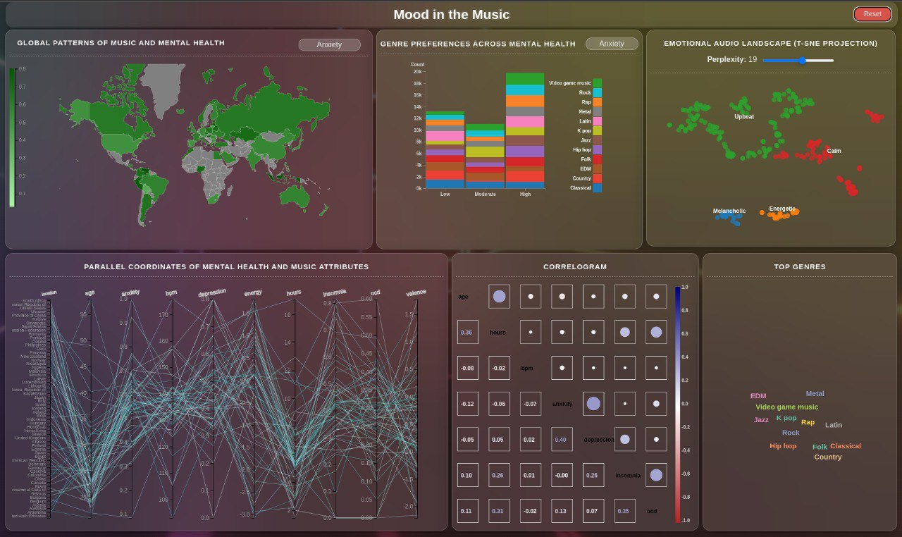

# Visualization Dashboard for Mental Health and Music Features Analysis

Welcome to the **Visualization Dashboard for Mental Health and Music Features Analysis**! This project is an innovative tool designed to bridge the gap between mental health metrics and music features, offering users a comprehensive platform to explore, analyze, and visualize data interactively. By leveraging advanced data processing techniques and machine learning models, this dashboard empowers users to uncover meaningful insights and patterns.



## Overview

The dashboard provides an intuitive interface for exploring the intricate relationships between mental health indicators and musical attributes. Whether you're a researcher, data enthusiast, or mental health advocate, this tool equips you with the resources to delve deep into the data and generate actionable insights.

Key highlights of the project include:

- **Dynamic Visualizations**: Interactive charts and graphs that bring your data to life.
- **Advanced Filtering Options**: Tailor your analysis by applying filters for specific regions, clusters, or metrics.
- **Predictive Analytics**: Harness the power of machine learning to predict mental health trends based on music features.
- **Exportable Insights**: Save your visualizations and summaries for offline use or presentations.
- **Clustering and Dimensionality Reduction**: Explore data clusters and reduce complexity using PCA.
- **Geospatial Analysis**: Visualize mental health metrics on choropleth maps with GeoJSON integration.

This dashboard is designed to be user-friendly, making it accessible to both technical and non-technical audiences.

## Why This Project?

Mental health and music are deeply interconnected, with music often serving as a therapeutic medium. By analyzing these relationships, this project aims to:

- Provide insights into how musical features influence mental well-being.
- Enable data-driven decision-making for mental health interventions.
- Foster a better understanding of global mental health trends through music.

Whether you're exploring the impact of music genres on mental health or identifying patterns across different regions, this dashboard serves as a powerful analytical tool.

## How It Works

The dashboard integrates a robust data processing pipeline with state-of-the-art visualization techniques. Users can interact with the data through an intuitive interface, apply filters, and generate insights in real time. The underlying machine learning models enhance the analytical capabilities, offering predictions and clustering for deeper exploration.

Get started today and unlock the potential of data-driven insights in mental health and music analysis! Visualization Dashboard for Mental Health and Music Features Analysis

## Data Processing Pipeline

The data processing pipeline is a crucial component of this project, transforming raw datasets into a unified and analyzable format. The pipeline ensures data consistency, accuracy, and readiness for visualization. Below are the sequential steps performed by the pipeline:

1. **Data Filtering**: Unnecessary features are removed, retaining only attributes relevant for analysis. This step ensures a focused and efficient exploration of the data.
2. **Decoupling Multi-Value Features**: Multi-value features are split into separate rows, enabling a more granular analysis.
3. **Linguistic Feature Analysis**: An NLP model standardizes and maps genre strings into specific categorical values, ensuring consistency and enabling meaningful comparisons.
4. **Normalization**: Numerical values are normalized to a consistent scale, improving interpretability and reducing biases.
5. **Data Merging**: All datasets are combined into a single, unified dataset, providing a comprehensive view for further processing.
6. **Handling Missing Values**: Missing data points are filled using linear regression techniques, minimizing data loss and maintaining dataset integrity.
7. **Duplicate Removal**: Duplicate rows are identified and removed to ensure the dataset remains clean and free of redundancy.
8. **Data Sampling and Clustering**: Principal Component Analysis (PCA) and K-means clustering are applied to group similar data points. Representative samples are selected from each cluster to improve computational efficiency without compromising insights.

This pipeline ensures that the data is preprocessed effectively, enabling accurate and meaningful analysis in the visualization dashboard.

## Installation and Setup

Follow these steps to set up and run the project:

### Prerequisites

- Python 3.8 or higher
- pip (Python package manager)

### Installation

Clone the repository:

```sh
git clone https://github.com/amirhnajafiz/visualization-dashboard.git
cd visualization-dashboard
python3 -m pip install -r requirements.txt
cd dashboard
python3 app.py --reload=True --debug=False --port=5000
```

## License

This project is licensed under the MIT License. See the [LICENSE](LICENSE) file for more details.
